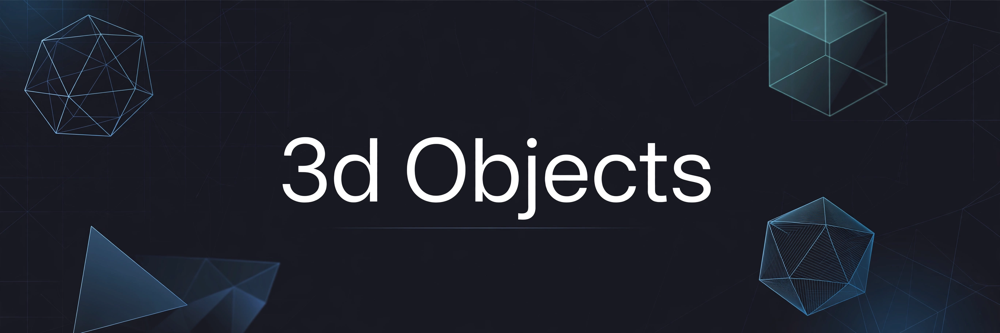
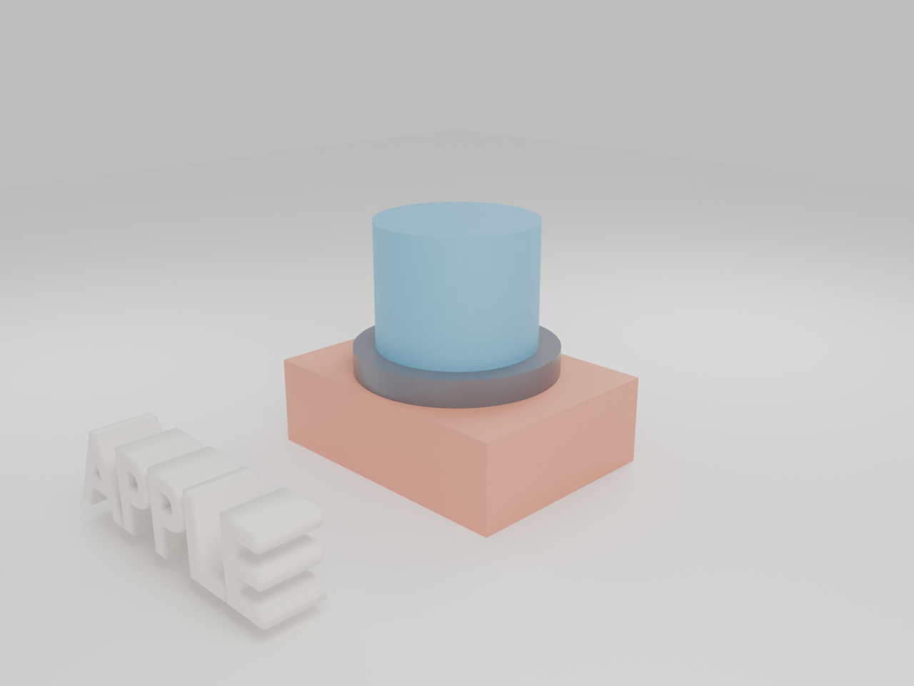
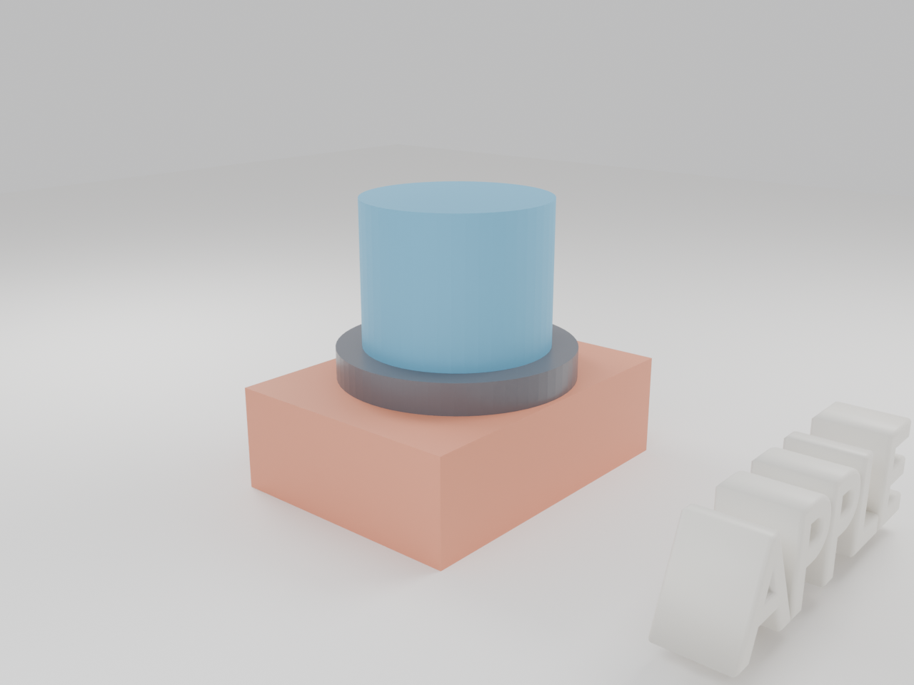
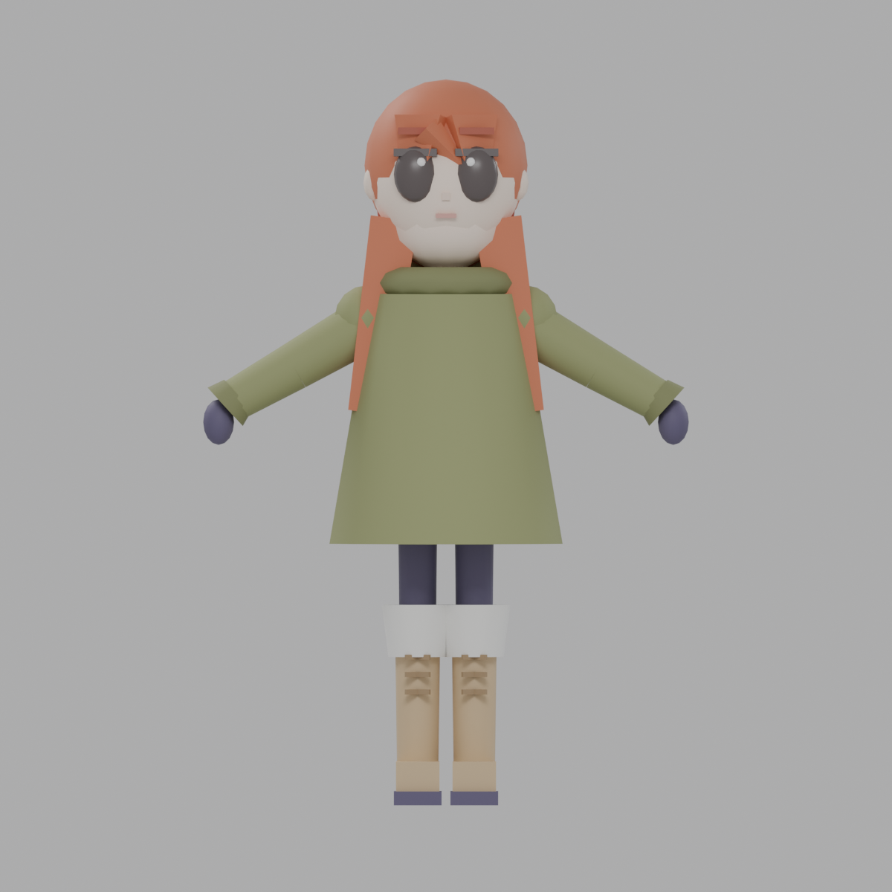
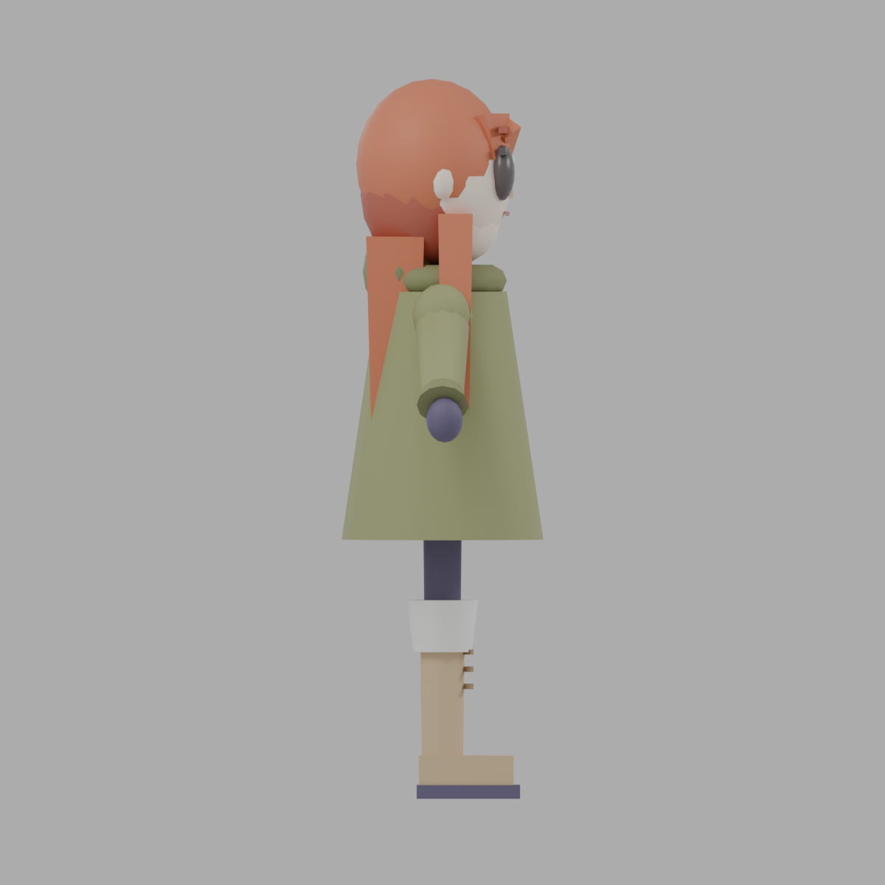
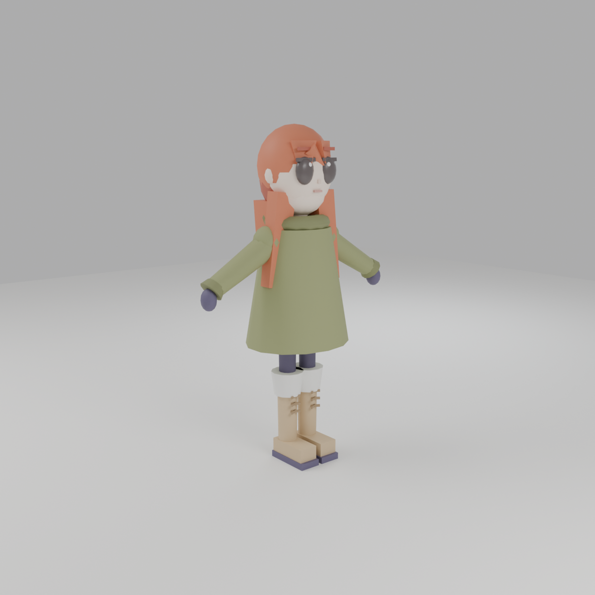
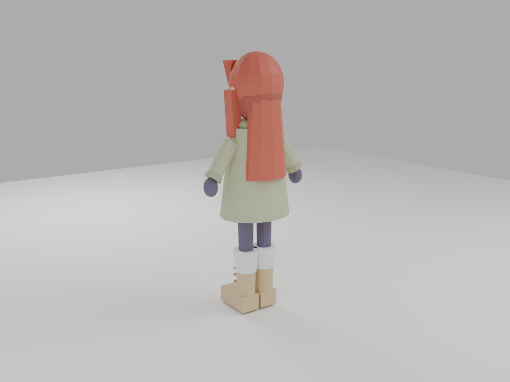

# 3d Objects

> ## Status: 🟢 Completed
>
> <progress value="95" max="100"></progress>
> **Progress: 95%** — Procedural Blender-built GLB asset library (staged scene + low-poly character) with a live React/three.js showcase site; everything verified working, only minor polish left.

<p align="center">
  
</p>


## What it is

A small 3D asset library of **procedurally generated GLB models**, built with
headless Blender scripts and designed for drag-and-drop use in **Spline**
(and anywhere `.glb` works). It ships two things: a staged studio scene
(terracotta rectangle + dark disc + blue cylinder + extruded 3D "APPLE" text)
and a low-poly red-haired girl character (olive hooded coat, dark leggings,
lace-up boots) modeled from a reference turnaround. A React + three.js
website renders the girl and the studio backdrop as an interactive
full-viewport hero scene.

## What works (verified)

- ✅ All 4 `.glb` files are valid glTF 2.0 binaries (magic + length headers check out: `background.glb`, `apple_text.glb`, `test_scene.glb`, `girl_redhair.glb`)
- ✅ Showcase site builds cleanly — `npm install` (88 packages) + `npm run build` → `✓ built in 3.15s`, tested 2026-10-08
- ✅ Site loads `background.glb` + `girl_redhair.glb` via react-three-fiber `useGLTF`, with shadows, orbit/zoom controls, auto-rotate, and a gentle idle bob/turn animation on the character
- ✅ 6 preview renders exist and are valid PNGs (`previews/` 1280×960, `previews/characters/` 1200×1200, front/side/back/angle)
- ✅ Both Blender generator scripts are real and complete (`test_scene_stack.py` 197 lines, `char_girl.py` 398 lines) — they clear the scene, build materials/geometry via `bpy`, and export GLBs + renders
- ✅ No CI workflows exist (checked `gh run list` — empty), no TODO/FIXME anywhere in the repo
- ✅ Repo is clean and minimal: models, previews, scripts, website only

## Tech stack

| Layer | Tech |
|---|---|
| 3D format | glTF 2.0 (`.glb`) |
| Modeling / generation | Blender 5.2.2 (headless, Python scripts) |
| Target editor | Spline (drag-and-drop import) |
| Showcase site | React 19 + Vite 8, `@react-three/fiber` 9, `@react-three/drei` 10, `three` 0.186 |
| Renders | Blender Cycles/EEVEE headless preview PNGs |

## How to run

**Showcase website** (tested 2026-10-08):

```bash
cd website
npm install
npm run dev    # or: npm run build && npm run preview
```

**Regenerate the models** (documented in the scripts' docstrings; needs Blender):

```bash
blender --background --python scripts/test_scene_stack.py
blender --background --python scripts/char_girl.py
# Set SKIP_RENDER=1 to skip preview renders and only re-export the .glb files
```

**Use in Spline:**

1. Drag `models/background.glb` into your Spline scene — that's the backdrop.
2. Drag `models/apple_text.glb` in as a second object — the text is its own
   layer, so you can move, rotate, or scale it freely without touching the stack.
3. Drag `models/characters/girl_redhair.glb` in for the character.

## Screenshots

From the repo's own `previews/` folder (rendered by the generator scripts):

<p>
  
  
</p>
<p>
  
  
  
  
</p>

## What you can add more

- [ ] **Replace `website/README.md`** — it's still the leftover Vite template text; document the actual site there
- [ ] **Deploy the showcase site** — it's build-ready; a GitHub Pages deploy would make the hero page public
- [ ] **Rig the girl character** — add a basic armature + a walk/idle animation clip so she's more than a static mesh
- [ ] **More characters/props** — the pipeline is proven; a second character or prop set multiplies the library's value
- [ ] **Spline import screenshots** — verify and document the drag-and-drop flow with actual Spline captures
- [ ] **Code-split the site bundle** — Vite warns the JS chunk is 1.2MB (three.js); lazy-load the 3D canvas to speed up first paint
- [ ] **CI** — a tiny GitHub Action running `npm run build` on push would catch site regressions automatically

## Project structure

```
3d_Objects/
├── README.md                    # this file
├── banner.webp                  # audit banner
├── models/
│   ├── background.glb           # studio backdrop stack (box + disc + cylinder)
│   ├── apple_text.glb           # extruded 3D "APPLE" text, separate layer
│   ├── test_scene.glb           # everything combined, full staged scene
│   └── characters/
│       └── girl_redhair.glb     # low-poly girl character
├── previews/
│   ├── test_scene_angle1.png    # scene render, angle 1
│   ├── test_scene_angle2.png    # scene render, angle 2
│   └── characters/              # girl_front/side/back/angle.png
├── scripts/
│   ├── test_scene_stack.py      # headless Blender: builds + exports the scene
│   └── char_girl.py             # headless Blender: builds + exports the girl
└── website/
    ├── src/App.jsx              # full-viewport three.js hero + overlay UI
    ├── public/models/           # GLBs served to the site
    └── package.json             # React 19 + three.js + Vite
```

---
*README written after code audit on 2026-10-08.*
